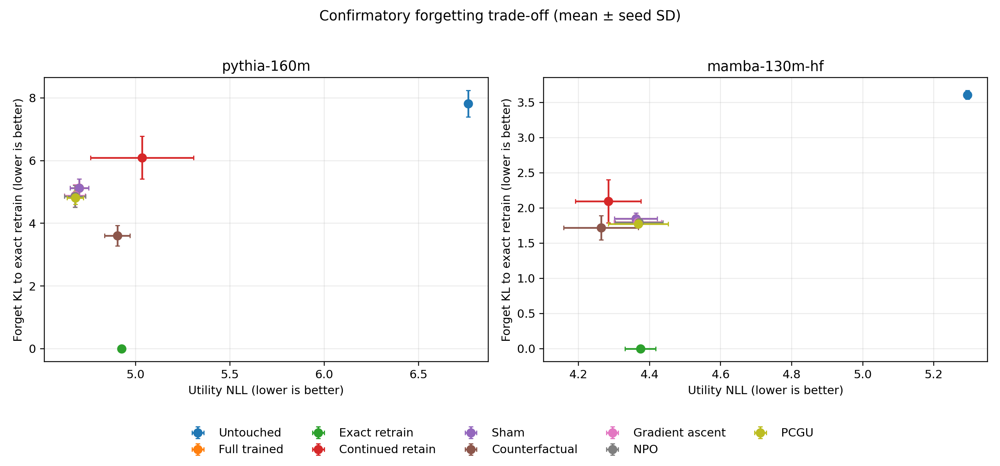

# UNLEARN-BENCH

A reproducible benchmark for controlled machine unlearning with exact retraining as the behavioral
oracle and explicit forgetting–utility–compute trade-offs.

**Status: RESEARCH COMPLETE / MAINTENANCE.** The confirmatory protocol was frozen at commit
`005db27a9f0b427bfa3fcc1cbcc3cc19da0c67a6`; all 54 planned cells completed. Historical results are
preserved but are not evidence for the reboot.

## Research Question

Under matched optimization budgets, which approximate unlearning methods move a model toward the
behavior of exact retain-only retraining on known forget examples while preserving retained
knowledge and held-out language-model utility?

A secondary exploratory question asks whether the observed trade-offs repeat across the selected
transformer and state-space checkpoints. The models are not matched well enough for causal
architecture claims.

## Why Machine Unlearning Is Hard

Making a model worse on a forget set is easy. Showing that specified training influence was removed
without destroying unrelated behavior is harder. Forget loss alone can reward indiscriminate model
damage, and inherited benchmark bias cannot be called “forgotten” when its training membership is
unknown. UNLEARN-BENCH therefore uses a known forget set, a retain set, a separate utility set, a
retain-only oracle, per-example outputs, negative controls, and explicit claim labels.

## Controlled Forget / Retain Setup

Track A begins from a pinned pretrained checkpoint. One copy is trained on retain plus forget
associations; intervention methods then target only the declared forget associations. Versioned
JSONL records identify partition, group, source, target/replacement, and content hash. The final v2
test has 12 forget prompts (four independent associations), 18 retain prompts (six associations),
and 10 utility examples. Its SHA-256 was sealed before confirmatory execution.

The earlier v1 test was exposed during development. It remains exploratory; no v1 number appears as
a confirmatory claim. See the [preregistration](docs/preregistration_main.md) and
[data-integrity record](reports/data_integrity_stop.md).

## Exact Retraining Oracle

For every seed, an independently initialized copy of the same base checkpoint is trained on retain
examples only. The primary forgetting endpoint is mean teacher-forced categorical KL divergence to
this exact-retrain model on held-out forget prompts (`forget_oracle_kl`, lower is better). The
primary utility endpoint is held-out utility NLL (`utility_nll`, lower is better). Exact retraining
has zero self-KL by definition; it is a behavioral reference, not proof of every deletion property.

## Methods

The frozen matrix contains nine controls and methods:

1. untouched pretrained model;
2. retain-plus-forget trained model;
3. exact retain-only retraining;
4. continued retain training;
5. seeded random-update sham;
6. counterfactual fine-tuning;
7. gradient ascent with retain regularization;
8. Negative Preference Optimization (NPO); and
9. Parameter-efficient Contrastive Gradient Unlearning (PCGU).

PCGU performs contrastive-gradient vector partitioning, cosine ranking, fixed-fraction selection,
and masked updates. Its adaptation from masked-LM social-bias editing to causal-LM controlled
associations is documented in [PCGU verification](docs/pcgu_verification.md).

## Models

- EleutherAI Pythia-160M, revision `50f5173` (transformer).
- State Spaces Mamba-130M-HF, revision `1e76775` (state-space model).
- A deterministic tiny association model used only for CPU tests and smoke validation.

Pythia and Mamba differ in more than architecture. Their comparison is observational. Larger
configured tiers were excluded before the main run in favor of a complete two-model matrix.

## Experimental Protocol

The 2 models × 9 methods × 3 seeds matrix used FP32 on A100 20 GiB MIG partitions. Full and exact
training used 20 steps with batch size four (80 examples processed); each approximate intervention
processed 48 examples under its frozen step/batch budget. Seeds were 11, 29, and 47. Analyses report
individual seeds, means/SDs, 10,000-draw hierarchical paired bootstrap intervals, exact content-unit
sign-flip tests, Holm correction, and Pareto frontiers. The analyzer was committed before results.

## Main Results

All 54 confirmatory cells completed with no OOM, numerical, technical, or method failure. Effects
below are method minus full-trained; negative values are favorable for both endpoints.

| Model | Method | Forget KL | Δ forget KL (95% bootstrap CI) | Utility NLL | Δ utility NLL (95% CI) |
| --- | --- | ---: | ---: | ---: | ---: |
| Pythia | full-trained | 5.1226 | reference | 4.7019 | reference |
| Pythia | counterfactual | 3.6046 | -1.5179 [-2.5617, -0.5393] | 4.9039 | +0.2020 [0.0956, 0.3300] |
| Pythia | gradient ascent | 4.8803 | -0.2423 [-0.4550, -0.0232] | 4.6788 | -0.0232 [-0.0428, -0.0054] |
| Pythia | NPO | 4.8626 | -0.2600 [-0.4817, -0.0325] | 4.6803 | -0.0216 [-0.0428, -0.0031] |
| Pythia | PCGU | 4.8189 | -0.3037 [-0.4253, -0.2245] | 4.6810 | -0.0210 [-0.0749, 0.0324] |
| Mamba | full-trained | 1.8494 | reference | 4.3615 | reference |
| Mamba | counterfactual | 1.7188 | -0.1306 [-0.4784, 0.1772] | 4.2635 | -0.0980 [-0.2319, 0.0114] |
| Mamba | PCGU | 1.7727 | -0.0767 [-0.1208, -0.0390] | 4.3683 | +0.0068 [-0.0387, 0.0350] |

Gradient ascent and NPO met the prespecified joint criterion for Pythia. No method met it for Mamba.
Counterfactual fine-tuning created the largest Pythia forgetting movement but damaged utility. No
Holm-adjusted comparison reached 0.05 (smallest adjusted p = 0.1523), reflecting the low power of
four independent forget groups. The complete table, including negative controls and all seeds, is
in [the confirmatory report](reports/MAIN_CONFIRMATORY_RESULTS.md).

## Forgetting vs Utility



Lower is better on both axes. Exact retraining defines the forgetting oracle but does not always
minimize held-out utility NLL. The [error analysis](reports/ERROR_ANALYSIS.md) shows that aggregate
means also conceal association-specific residuals and localized retain damage.

## Compute

The confirmatory matrix used 413 scheduler A100-seconds (0.115 GPU-hours). Peak allocation was 9.74
GiB for Pythia and 15.84 GiB for Mamba. All 54 checkpoints were saved, SHA-256 validated, and retained
outside normal Git tracking; together they occupy 31,481,561,142 bytes. Mamba used the documented
sequential eager implementation because optional fused kernels were unavailable. No Mac M3 was
available, so MPS performance and passive-cooling behavior remain unmeasured.

## External Generalization

Track B evaluated all 54 checkpoints on all 2,106 official StereoSet dev intrasentence examples.
This is **exploratory external bias behavior, not machine forgetting**. Pythia counterfactual moved
SS 1.00 point toward the neutral target of 50 while losing 0.97 LMS; Mamba counterfactual moved 0.62
away and lost 0.82 LMS. Small average changes and substantial category heterogeneity argue against
a general debiasing claim. See [Track B results](reports/TRACK_B_STEREOSET.md).

## Reproducibility

Install Python 3.10+ dependencies:

```bash
pip install -e '.[dev,hf,figures]'
```

Core commands:

```bash
python scripts/prepare_data.py
python scripts/run_experiment.py --config configs/experiments/smoke.yaml --device cpu --precision fp32
python scripts/run_experiment.py --config configs/experiments/smoke.yaml --method pcgu --seed 11 --device cpu --precision fp32
for c in configs/experiments/main.yaml configs/experiments/main_mamba.yaml; do MAIN_CONFIG="$c" sbatch scripts/slurm_main.sh; done
python scripts/evaluate.py --run RUN_ID
python scripts/aggregate_results.py
python scripts/analyze_confirmatory.py
python scripts/analyze_track_b.py
python scripts/validate_results.py
```

The committed main marker intentionally fails closed after source changes; a new scientific rerun
must create a new preregistration and calibration approval rather than masquerade as the historical
confirmatory execution. Clean checkouts validate committed manifests without downloading 31 GB of
checkpoints; strict confirmatory reanalysis requires those hash-identified external files. See
[reproducibility](docs/reproducibility.md).

## Repository Structure

```text
configs/                 datasets, models, methods, and frozen experiment settings
data/controlled/         v1 exploratory and v2 confirmatory controlled records
docs/                    protocol, audits, methodology, reproduction, and portfolio package
reports/                 generated reports, tables, figures, and phase records
results/runs/            Track A manifests, metrics, and per-example predictions
results/track_b/         Track B manifests, metrics, and per-example predictions
scripts/                 execution, evaluation, validation, and analysis entry points
src/unlearn_bench/       models, methods, metrics, statistics, and provenance utilities
tests/                   lightweight unit and end-to-end behavioral tests
Unlearning/              preserved HISTORICAL / UNVERIFIED project state
```

## Legacy Audit

`Final_Report.pdf` and `Unlearning/` are retained for provenance. Historical 46.82, 46.73, and 46.49
scores and associated claims are **HISTORICAL / UNVERIFIED** and must not be cited as reboot results.
See the [legacy audit](docs/legacy_audit.md).

## Limitations

The confirmatory task is synthetic and contains only four independent forget associations and three
seeds. The models are small and confounded across family. The optimization horizon is short; the
study measures behavioral approximation to retain-only retraining, not parameter-level erasure,
membership privacy, legal compliance, or robustness to adversarial extraction. FP32 A100 execution
was measured, but M3/MPS was not. StereoSet cannot reveal whether pretraining examples were removed.
See the full [limitations](docs/limitations.md).

## Future Work

The project is frozen against method proliferation. Appropriate future work is an external
replication with a larger independent forget holdout, preregistered PCGU sensitivity analysis,
membership/privacy evaluation, stronger matched model tiers, and measured M3 reproduction. New
methods should be added only when a published result motivates a new frozen comparison.
